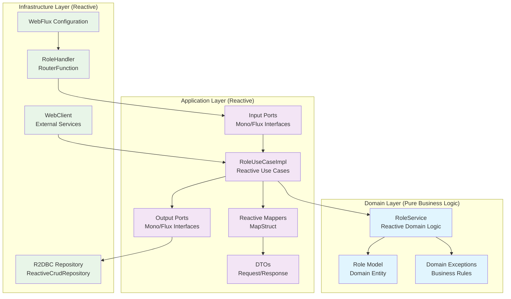
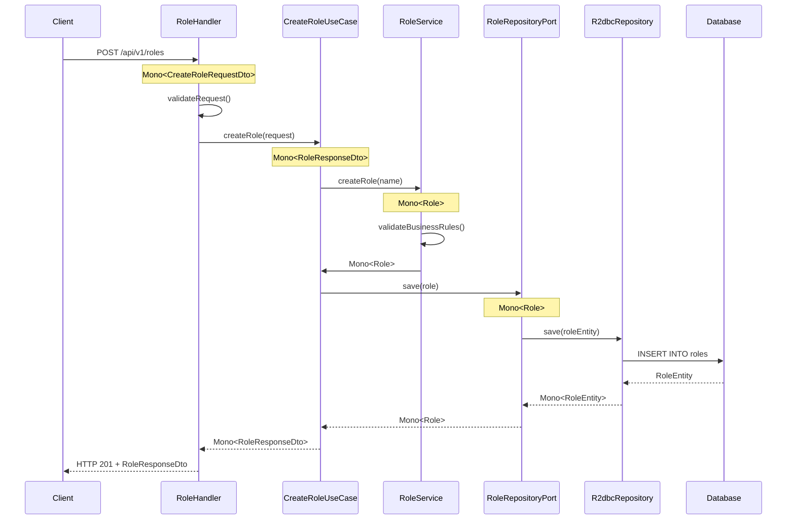

# Hex4j WebFlux - Plantilla de Arquitectura Hexagonal Reactiva

Una implementación completa de arquitectura hexagonal (patrón Ports and Adapters) utilizando Spring Boot WebFlux para programación reactiva.

## 🚀 Características

- **Programación Reactiva**: Construido con Spring Boot WebFlux para operaciones no bloqueantes y reactivas
- **Arquitectura Hexagonal**: Separación clara de responsabilidades con capas de dominio, aplicación e infraestructura
- **Integración R2DBC**: Acceso reactivo a base de datos con H2 en memoria
- **Enrutamiento Funcional**: Enrutamiento basado en RouterFunction en lugar de controladores tradicionales
- **Testing Integral**: Testing reactivo con StepVerifier y WebTestClient
- **Integración MapStruct**: Mapeo automático entre DTOs y modelos de dominio
- **Manejo de Errores Reactivo**: Manejo centralizado de excepciones con GlobalErrorHandler
- **Logging Reactivo**: Aspectos de logging adaptados para programación reactiva

## 📋 Requisitos Previos

- **Java 21** o superior
- **Gradle 8.7** o superior
- **Git** para clonar el repositorio

## 🏗️ Arquitectura Hexagonal Reactiva

### Estructura de Paquetes

```
co.onmind.hex4jwebflux/
├── domain/                    # Capa de Dominio (Core Business Logic)
│   ├── models/               # Entidades de dominio
│   ├── services/             # Servicios de dominio reactivos
│   └── exceptions/           # Excepciones de dominio
├── application/              # Capa de Aplicación (Use Cases)
│   ├── dto/
│   │   ├── in/              # DTOs de entrada
│   │   └── out/             # DTOs de salida
│   ├── mappers/             # Mappers reactivos entre DTOs y modelos
│   ├── usecases/            # Implementaciones de casos de uso reactivos
│   └── ports/
│       ├── in/              # Puertos de entrada reactivos (Use Cases)
│       └── out/             # Puertos de salida reactivos (Repositories)
├── infrastructure/          # Capa de Infraestructura (Adapters)
│   ├── configuration/       # Configuraciones de Spring WebFlux
│   ├── handlers/            # Handlers reactivos (en lugar de controllers)
│   ├── persistence/         # Implementaciones de persistencia R2DBC
│   │   ├── adapters/        # Adaptadores de repositorio
│   │   ├── entities/        # Entidades R2DBC
│   │   ├── mappers/         # Mappers de entidades
│   │   └── repositories/    # Repositorios R2DBC
│   └── webclients/          # Clientes web reactivos para servicios externos
└── transverse/              # Componentes Transversales
    ├── exceptions/          # Manejo global de errores reactivo
    └── logging/             # Aspectos de logging reactivos
```

### Diagrama de Arquitectura



## 🔄 Flujo Reactivo Completo del Ejemplo Role

### 1. Flujo de Creación de Role



### 2. Características Reactivas Clave

- **Mono/Flux**: Todos los métodos retornan tipos reactivos
- **Non-blocking**: Operaciones no bloqueantes en toda la aplicación
- **Backpressure**: Manejo automático de contrapresión
- **Error Handling**: Manejo reactivo de errores con `onErrorResume`
- **Composition**: Composición de operaciones reactivas con `flatMap`, `map`, etc.

## 🚀 Inicio Rápido

### Instalación y Ejecución

1. **Clonar el repositorio**:
```bash
git clone <repository-url>
cd hex4j-webflux
```

2. **Ejecutar la aplicación**:
```bash
./gradlew bootRun
```

La aplicación se iniciará en el puerto 8080.

3. **Verificar que la aplicación esté funcionando**:
```bash
curl http://localhost:8080/actuator/health
```

### Ejecutar Tests

```bash
# Ejecutar todos los tests
./gradlew test

# Ejecutar tests con reporte de cobertura
./gradlew test jacocoTestReport

# Ejecutar solo tests unitarios
./gradlew test --tests "*Test"

# Ejecutar solo tests de integración
./gradlew test --tests "*IntegrationTest"
```

## 🌐 API Endpoints

### Endpoints Reactivos Disponibles

| Método | Endpoint | Descripción | Request Body | Response |
|--------|----------|-------------|--------------|----------|
| `POST` | `/api/v1/roles` | Crear un nuevo role | `CreateRoleRequestDto` | `RoleResponseDto` |
| `GET` | `/api/v1/roles` | Obtener todos los roles | - | `Flux<RoleResponseDto>` |
| `GET` | `/api/v1/roles/{id}` | Obtener role por ID | - | `RoleResponseDto` |
| `GET` | `/api/v1/roles/search?name={pattern}` | Buscar roles por patrón de nombre | - | `Flux<RoleResponseDto>` |

### Ejemplos de Uso

#### Crear un Role
```bash
curl -X POST http://localhost:8080/api/v1/roles \
  -H "Content-Type: application/json" \
  -d '{"name": "ADMIN"}'
```

**Respuesta**:
```json
{
  "id": 1,
  "name": "ADMIN",
  "createdAt": "2024-01-15T10:30:00"
}
```

#### Obtener todos los Roles
```bash
curl http://localhost:8080/api/v1/roles
```

**Respuesta**:
```json
[
  {
    "id": 1,
    "name": "ADMIN",
    "createdAt": "2024-01-15T10:30:00"
  },
  {
    "id": 2,
    "name": "USER",
    "createdAt": "2024-01-15T10:31:00"
  }
]
```

#### Obtener Role por ID
```bash
curl http://localhost:8080/api/v1/roles/1
```

#### Buscar Roles por Nombre
```bash
curl "http://localhost:8080/api/v1/roles/search?name=ADM"
```

## ⚙️ Configuración

### Dependencias Reactivas Principales

El proyecto utiliza las siguientes dependencias clave para programación reactiva:

```gradle
dependencies {
    // Spring Boot WebFlux - Framework reactivo principal
    implementation 'org.springframework.boot:spring-boot-starter-webflux'
    
    // Spring Data R2DBC - Acceso reactivo a base de datos
    implementation 'org.springframework.boot:spring-boot-starter-data-r2dbc'
    
    // R2DBC H2 - Driver reactivo para H2
    runtimeOnly 'io.r2dbc:r2dbc-h2'
    runtimeOnly 'com.h2database:h2'
    
    // Validation - Validación de datos
    implementation 'org.springframework.boot:spring-boot-starter-validation'
    
    // MapStruct - Mapeo de objetos
    implementation 'org.mapstruct:mapstruct:1.5.5.Final'
    annotationProcessor 'org.mapstruct:mapstruct-processor:1.5.5.Final'
    
    // Testing Reactivo
    testImplementation 'io.projectreactor:reactor-test'
    testImplementation 'org.springframework.boot:spring-boot-starter-test'
}
```

### Configuración de Base de Datos R2DBC

```yaml
spring:
  r2dbc:
    url: r2dbc:h2:mem:///hex4jwebflux;DB_CLOSE_DELAY=-1;DB_CLOSE_ON_EXIT=FALSE
    username: sa
    password: password
```

### Configuración de WebFlux

```yaml
server:
  port: 8080

spring:
  webflux:
    base-path: /api/v1
```

## 🧪 Testing Reactivo

### Estrategia de Testing

La aplicación implementa una pirámide de testing reactivo:

1. **Tests Unitarios Reactivos (70%)**
   - Servicios de dominio con `StepVerifier`
   - Casos de uso reactivos
   - Mappers y validaciones

2. **Tests de Integración Reactivos (20%)**
   - Handlers con `WebTestClient`
   - Repositorios R2DBC con `@DataR2dbcTest`

3. **Tests End-to-End Reactivos (10%)**
   - `@SpringBootTest` con `WebTestClient`
   - Flujos completos de API reactiva

### Ejemplo de Test Reactivo

```java
@ExtendWith(MockitoExtension.class)
class RoleServiceTest {
    
    @Test
    void shouldCreateRoleReactively() {
        // Given
        String roleName = "ADMIN";
        Role expectedRole = new Role(roleName);
        
        // When
        Mono<Role> result = roleService.createRole(roleName);
        
        // Then
        StepVerifier.create(result)
            .expectNext(expectedRole)
            .verifyComplete();
    }
}
```

### Test de Handler con WebTestClient

```java
@WebFluxTest(RoleHandler.class)
class RoleHandlerTest {
    
    @Autowired
    private WebTestClient webTestClient;
    
    @Test
    void shouldCreateRoleViaHandler() {
        // Given
        CreateRoleRequestDto request = new CreateRoleRequestDto("ADMIN");
        
        // When & Then
        webTestClient.post()
            .uri("/api/v1/roles")
            .bodyValue(request)
            .exchange()
            .expectStatus().isCreated()
            .expectBody(RoleResponseDto.class)
            .value(response -> {
                assertThat(response.name()).isEqualTo("ADMIN");
                assertThat(response.id()).isNotNull();
            });
    }
}
```

## 🔧 Desarrollo y Extensión

### Diferencias Clave con hex4j (Spring MVC)

| Aspecto | hex4j (Spring MVC) | hex4j-webflux (WebFlux) |
|---------|-------------------|-------------------------|
| **Framework** | Spring MVC | Spring WebFlux |
| **Modelo de Programación** | Imperativo/Bloqueante | Reactivo/No-bloqueante |
| **Controladores** | `@RestController` | `RouterFunction` + `Handler` |
| **Persistencia** | JPA/Hibernate | R2DBC |
| **Tipos de Retorno** | Objetos directos | `Mono<T>` / `Flux<T>` |
| **Testing** | MockMvc | WebTestClient + StepVerifier |
| **Base de Datos** | H2 con JDBC | H2 con R2DBC |

### Cómo Extender la Plantilla con Nuevas Entidades

#### 1. Crear el Modelo de Dominio

```java
// domain/models/User.java
public class User {
    private Long id;
    private String username;
    private String email;
    private LocalDateTime createdAt;
    
    // Constructor, getters, setters, business logic
}
```

#### 2. Crear el Servicio de Dominio Reactivo

```java
// domain/services/UserService.java
@Service
public class UserService {
    
    public Mono<User> createUser(String username, String email) {
        return Mono.fromCallable(() -> {
            // Validaciones de negocio
            validateUsername(username);
            validateEmail(email);
            return new User(username, email);
        });
    }
    
    public Mono<Void> validateBusinessRules(User user) {
        // Lógica de validación reactiva
        return Mono.empty();
    }
}
```

#### 3. Definir DTOs

```java
// application/dto/in/CreateUserRequestDto.java
public record CreateUserRequestDto(
    @NotBlank String username,
    @Email String email
) {}

// application/dto/out/UserResponseDto.java
public record UserResponseDto(
    Long id,
    String username,
    String email,
    LocalDateTime createdAt
) {}
```

#### 4. Crear Puertos Reactivos

```java
// application/ports/in/CreateUserUseCase.java
public interface CreateUserUseCase {
    Mono<UserResponseDto> createUser(CreateUserRequestDto request);
}

// application/ports/out/UserRepositoryPort.java
public interface UserRepositoryPort {
    Mono<User> save(User user);
    Mono<User> findById(Long id);
    Flux<User> findAll();
    Mono<Boolean> existsByUsername(String username);
}
```

#### 5. Implementar Caso de Uso Reactivo

```java
// application/usecases/UserUseCaseImpl.java
@Component
public class UserUseCaseImpl implements CreateUserUseCase, GetUserUseCase {
    
    private final UserService userService;
    private final UserRepositoryPort userRepository;
    private final UserMapper userMapper;
    
    @Override
    public Mono<UserResponseDto> createUser(CreateUserRequestDto request) {
        return Mono.just(request)
            .map(userMapper::toEntity)
            .flatMap(user -> userService.createUser(user.getUsername(), user.getEmail()))
            .flatMap(userService::validateBusinessRules)
            .flatMap(userRepository::save)
            .map(userMapper::toResponseDto);
    }
}
```

#### 6. Crear Entidad R2DBC y Repositorio

```java
// infrastructure/persistence/entities/UserEntity.java
@Table("users")
public class UserEntity {
    @Id
    private Long id;
    
    @Column("username")
    private String username;
    
    @Column("email")
    private String email;
    
    @Column("created_at")
    private LocalDateTime createdAt;
}

// infrastructure/persistence/repositories/R2dbcUserRepository.java
public interface R2dbcUserRepository extends ReactiveCrudRepository<UserEntity, Long> {
    Mono<Boolean> existsByUsername(String username);
    Mono<UserEntity> findByEmail(String email);
}
```

#### 7. Implementar Adaptador de Persistencia

```java
// infrastructure/persistence/adapters/UserRepositoryAdapter.java
@Repository
public class UserRepositoryAdapter implements UserRepositoryPort {
    
    private final R2dbcUserRepository r2dbcRepository;
    private final UserEntityMapper entityMapper;
    
    @Override
    public Mono<User> save(User user) {
        return Mono.just(user)
            .map(entityMapper::toEntity)
            .flatMap(r2dbcRepository::save)
            .map(entityMapper::toDomain);
    }
}
```

#### 8. Crear Handler Reactivo

```java
// infrastructure/handlers/UserHandler.java
@Component
public class UserHandler {
    
    private final CreateUserUseCase createUserUseCase;
    private final GetUserUseCase getUserUseCase;
    
    public Mono<ServerResponse> createUser(ServerRequest request) {
        return request.bodyToMono(CreateUserRequestDto.class)
            .flatMap(createUserUseCase::createUser)
            .flatMap(user -> ServerResponse.status(HttpStatus.CREATED)
                .contentType(MediaType.APPLICATION_JSON)
                .bodyValue(user))
            .onErrorResume(this::handleError);
    }
}
```

#### 9. Configurar Rutas

```java
// infrastructure/configuration/UserRouterConfiguration.java
@Configuration
public class UserRouterConfiguration {
    
    @Bean
    public RouterFunction<ServerResponse> userRoutes(UserHandler userHandler) {
        return RouterFunctions
            .route(POST("/api/v1/users"), userHandler::createUser)
            .andRoute(GET("/api/v1/users"), userHandler::getAllUsers)
            .andRoute(GET("/api/v1/users/{id}"), userHandler::getUserById);
    }
}
```

### Mejores Prácticas para Desarrollo Reactivo

1. **Evitar Bloqueos**: Nunca usar `.block()` en código de producción
2. **Composición**: Usar `flatMap`, `map`, `filter` para componer operaciones
3. **Manejo de Errores**: Usar `onErrorResume`, `onErrorReturn` para manejo reactivo de errores
4. **Testing**: Siempre usar `StepVerifier` para testing de streams reactivos
5. **Backpressure**: Considerar estrategias de backpressure para streams grandes
6. **Schedulers**: Usar schedulers apropiados para operaciones CPU-intensivas

## 📊 Monitoreo y Observabilidad

### Endpoints de Actuator

La aplicación incluye endpoints de monitoreo:

- `/actuator/health` - Estado de salud de la aplicación
- `/actuator/info` - Información de la aplicación
- `/actuator/metrics` - Métricas de la aplicación

### Logging Reactivo

El proyecto incluye logging reactivo configurado:

```yaml
logging:
  level:
    co.onmind.hex4jwebflux: DEBUG
    org.springframework.r2dbc: DEBUG
    reactor.netty: INFO
```

## 🤝 Contribución

1. Fork el proyecto
2. Crea una rama para tu feature (`git checkout -b feature/AmazingFeature`)
3. Commit tus cambios (`git commit -m 'Add some AmazingFeature'`)
4. Push a la rama (`git push origin feature/AmazingFeature`)
5. Abre un Pull Request

## 👥 Autores

- **OnMind (Cesar Andres Arcila Buitrago)** - *Desarrollo inicial* - [GitHub](https://github.com/onmind)

## 🙏 Agradecimientos

- Inspirado en los principios de Arquitectura Hexagonal de Alistair Cockburn
- Basado en los patrones de Domain-Driven Design de Eric Evans
- Implementado con Spring Boot WebFlux para programación reactiva
